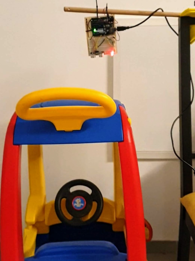

# garageSensor
Project with my kids. Detect that a car is parked beneath the sensor.

Kids asked how a parking garage indcator light worked (The type that is green when the space is vacant, and red when it's occupied). So I suggested that we build one.

When distance sensor detects an item closer than the configured distance, the light changes from red to green.

## Created by
- ___Eitan Appleby (7)___
- ___Hillel Appleby (5)___
- ___Doron Appleby (2)___
- ___Bryan Appleby (35)___
