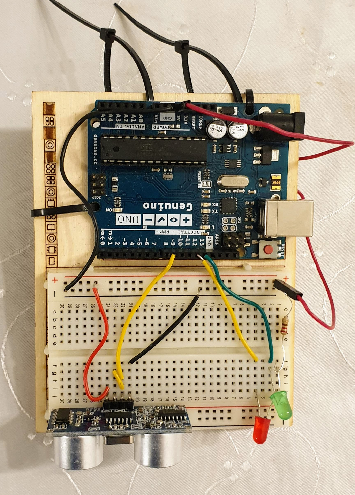

# garageSensor
Project with my kids. Detect that a car is parked beneath the sensor.

Kids asked how a parking garage indcator light worked (The type that is green when the space is vacant, and red when it's occupied). So I suggested that we build one.

